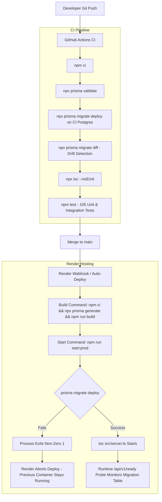

# Database Migration Policy & Operational Runbook

This document defines the zero-downtime database migration policy, deployment automation, troubleshooting matrix, and recovery procedures for the **Content Platform API** on PostgreSQL and Prisma.

---

## 1. Core Principles & Golden Rules

1. **Additive-Only Migrations (Expand → Deploy → Contract)**:
   - Every migration must be forward-compatible with older running application code.
   - **Allowed**: New tables, new indexes, new nullable columns, new columns with `DEFAULT` values.
   - **Forbidden in a single release**: Renaming columns, dropping columns, changing column types destructively, or adding non-nullable columns without defaults.
   - **Two-phase removal (Contract)**: To drop/rename a column, first release code that stops writing/reading it. In a subsequent release, drop or rename the unused column.
2. **Never Run `prisma db push` or `prisma migrate reset` Against Production**:
   - `db push` bypasses migration history (`_prisma_migrations`), leading to untracked schema drifts.
   - `migrate reset` drops the entire database.
   - Production environments **only ever execute** `prisma migrate deploy`.
3. **Never Edit or Delete Applied Migrations**:
   - Once a migration is committed and applied anywhere (local, CI, staging, production), its checksum is locked in `_prisma_migrations`.
   - Fix forward with a new migration.
4. **Mandatory Pre-Deployment Backup**:
   - Before applying manual migrations or running major architectural changes, always export a clean `pg_dump`.
5. **No Secrets in Code or Logs**:
   - `DATABASE_URL` is passed only as an environment variable in hosting dashboards or isolated shell sessions.

---

## 2. Automated Deployment Architecture (Render Free Plan)

Because Render's Free Plan does not support separate Pre-Deploy commands or SSH shell access, migration execution is baked safely into the application startup path:

```
Start Command: npm run start:prod
└──> 1. prisma migrate deploy (Applies pending migrations with advisory lock)
└──> 2. tsx src/server.ts     (Starts HTTP server only if migrations succeed)
```

### End-to-End Deployment Flow



### Why This Is Safe:
- **Atomicity**: Prisma takes a database advisory lock during `migrate deploy`, preventing double-execution across multiple instances.
- **Fail-Closed**: If a migration fails (e.g. timeout or lock contention), the process exits `1` before Express starts listening. Render marks the deployment failed and keeps the prior working release active.
- **Zero Drift**: The `/api/v1/ready` readiness probe continuously monitors the `_prisma_migrations` table and returns HTTP 503 if any migration is recorded as failed or unapplied.

---

## 3. Render Web Service Configuration

In the [Render Dashboard](https://dashboard.render.com/):

| Setting | Recommended Value | Rationale |
| :--- | :--- | :--- |
| **Build Command** | `npm ci && npx prisma generate && npm run build` | Ensures dependencies, Prisma client generation, and typechecks pass. |
| **Start Command** | `npm run start:prod` | Runs `prisma migrate deploy && tsx src/server.ts`. |
| **Node Version** | `22.x` (or matches `.nvmrc`) | Aligns runtime with Vitest and modern Node LTS. |

---

## 4. Manual Migration & Recovery Runbook

If you ever need to manually inspect or apply migrations from your workstation:

### Step 1: Export Database URL in Your Terminal
```bash
# Obtain External Database URL from Render Dashboard -> PostgreSQL -> Connections
export DATABASE_URL="postgresql://<user>:<password>@<host>/<database>?sslmode=require"
```

### Step 2: Safety Backup
```bash
pg_dump "$DATABASE_URL" -F c -b -v -f /tmp/content_platform_backup_$(date +%Y%m%d_%H%M%S).dump
```

### Step 3: Check Status
```bash
npx prisma migrate status
```

### Step 4: Apply Pending Migrations
```bash
npx prisma migrate deploy
```

### Step 5: Clean Up Environment
```bash
unset DATABASE_URL
```

---

## 5. Troubleshooting & Symptom Matrix

| Error Code / Symptom | Root Cause | Resolution |
| :--- | :--- | :--- |
| **P2021**: `Table ... does not exist` | New code deployed before migration was run on the database. | Run `npx prisma migrate deploy` using the external `DATABASE_URL`, or ensure the Start Command is set to `npm run start:prod`. |
| **P2022**: `Column ... does not exist` | Schema column missing in production database. | Run `npx prisma migrate deploy`. |
| **P3005**: `The database schema is not empty` | Initial baseline migration missing from `_prisma_migrations`. | Mark initial migration as applied: `npx prisma migrate resolve --applied 20260901122315_init`. |
| **P3009 / P3018**: `Migration ... failed to apply` | A migration failed midway (e.g. constraint violation). | 1. Inspect error in logs.<br>2. Fix database state manually.<br>3. Mark resolved: `npx prisma migrate resolve --applied <migration_name>` or `--rolled-back <migration_name>`. |
| **HTTP 503 on `/api/v1/ready`** | Database unreachable or migration failure detected in `_prisma_migrations`. | Check `/api/v1/ready` response body for `database.failedMigration`. |

---

## 6. Free-Tier Database Considerations & Retention

1. **Render Free PostgreSQL Expiry**:
   - Render Free PostgreSQL databases expire after **30 days** from creation.
   - To avoid total data loss, periodically export database backups via `pg_dump`.
2. **Cold Starts**:
   - Render free web services spin down after 15 minutes of inactivity.
   - Cold boot takes ~30–50 seconds. The `start:prod` script adds negligible overhead (~1.5 seconds) to verify migrations during spin-up.
3. **Alternative Free PostgreSQL Hosts**:
   - For persistent databases without 30-day expiration, consider connecting to free-tier cloud Postgres providers such as **Neon.tech** (serverless Postgres) or **Supabase** via `DATABASE_URL`.
